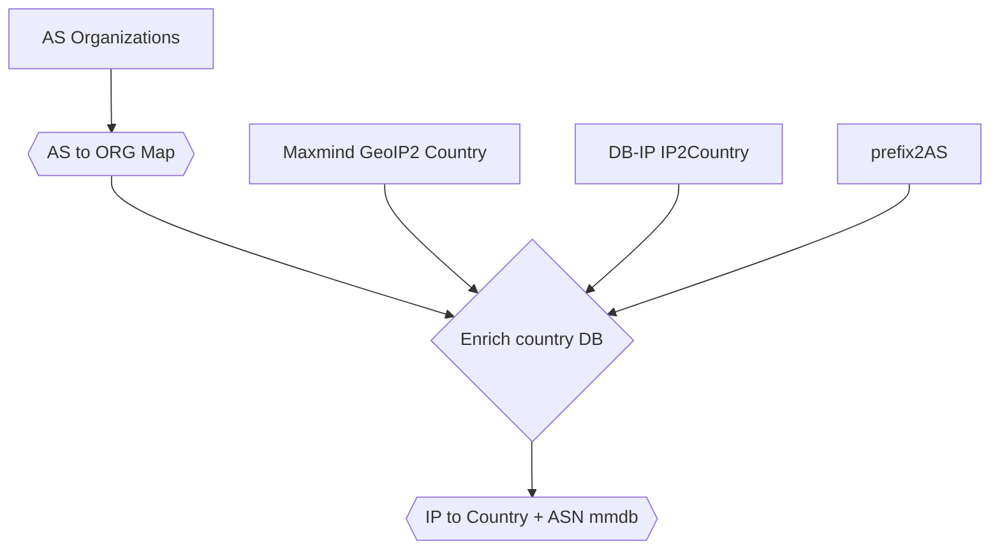

# Historical GeoIP databases

The purpose of this repo is to build historical IP to country + AS databases
for use in the OONI data processing pipeline, but potentially for use by the
probes as well.

The data sources used for IP to country mappings are:
* Historical copies of [Maxmind GeoIP2 Country Lite](https://dev.maxmind.com/geoip/geolite2-free-geolocation-) from [20180206 to 20191224](https://archive.org/download/maxmind-geolite2-country).
* From 2020-02 onward we use monthly [DB-IP IP2Country Lite](https://db-ip.com/db/download/ip-to-country-lite), which are also [publicly archived](https://archive.org/download/dbip-country-lite).

For mapping IP ranges to ASNs we use the [prefix2as mappings from CAIDA](https://publicdata.caida.org/datasets/routing/routeviews-prefix2as/).

For mapping ASNs with metadata about the organization, we use the as [AS to Organization mappings from CAIDA](https://publicdata.caida.org/datasets/as-organizations/).

The primary entry point for running the full workflow is the following:
```
./update_databases.sh
```

In order to upload the built artifacts to archive.org, you should have the set
`IA_ACCESS_KEY` and `IA_SECRET_KEY` environment variables.

The workflow for generating the final artifacts (the IP to country + ASN mmdb
files) is the following:


Both the AS to ORG Map and the timestamped IP to Country + ASN mmdb files are
[published as artifacts on archive.org](https://archive.org/download/ip2country-as).

Note: if the repository is inactive for more than 60 days, the GitHub action
that publishes artifacts is disabled and we don't publish artifacts.

The IP to Country + ASN is compatible with the mmdb file format, but country
and ASN lookup are supported inside of the same call.

The keys used in the result for returning metadata information are the following:
* `autonomous_system_number`, this is an INT indicating the ASN. It's a standard key.
* `autonomous_system_organization`, this is a string indicating the
  organization name for the given ASN. It's a standard key.
* `autonomous_system_country`, is the country of registration of the AS
  organization. This key is non-standard.
* `autonomous_system_name`, is the name of the AS, which in most cases is
  different from the organization name. This key is non-standard.
